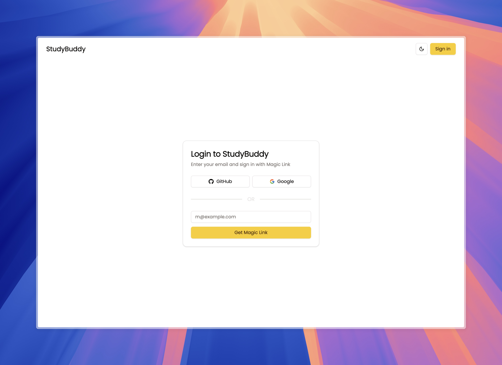
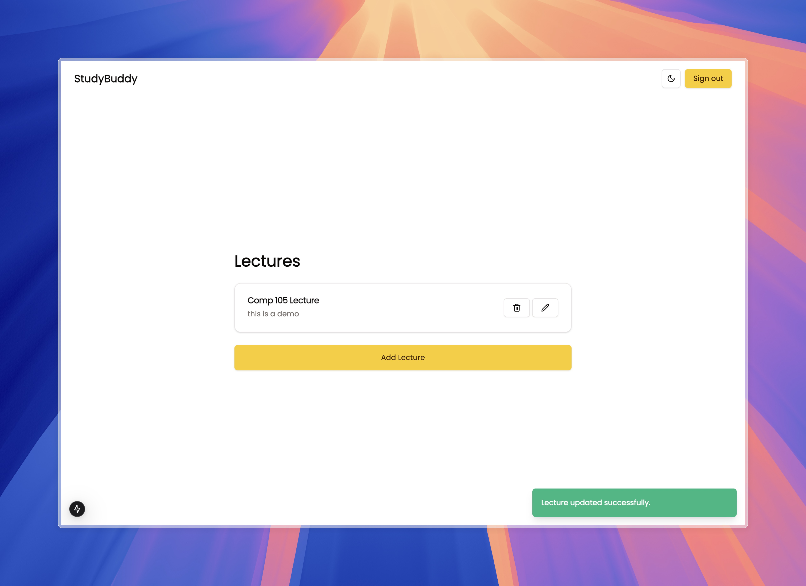
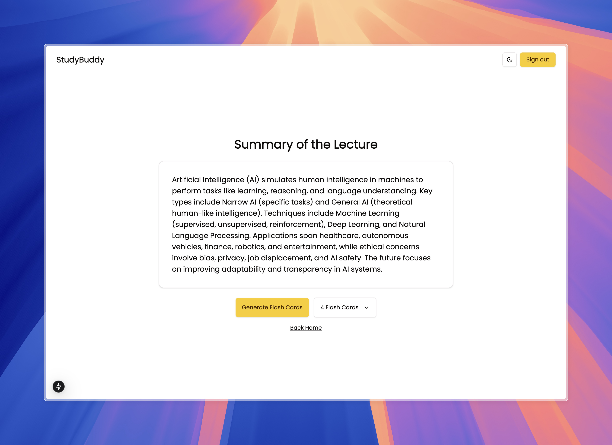
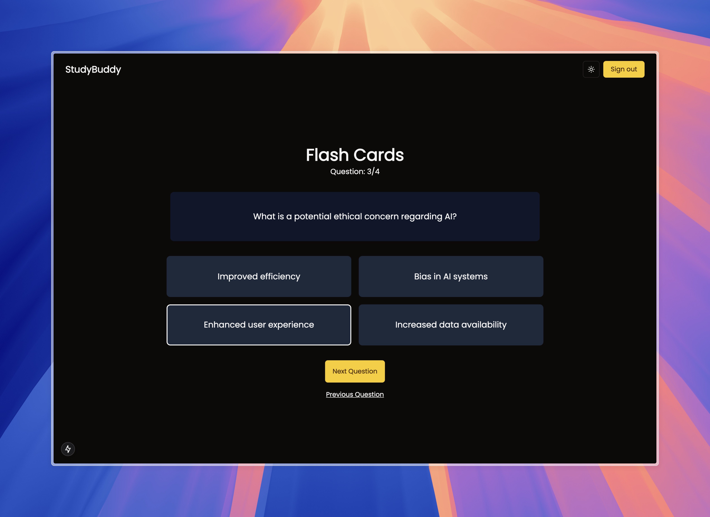
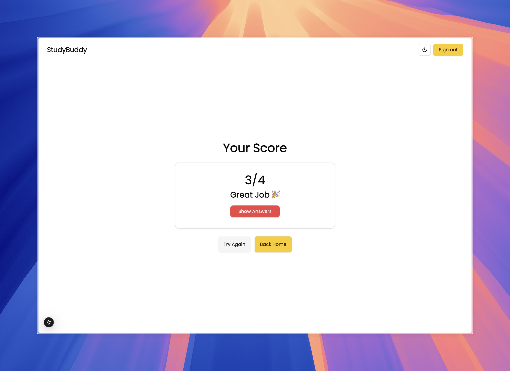
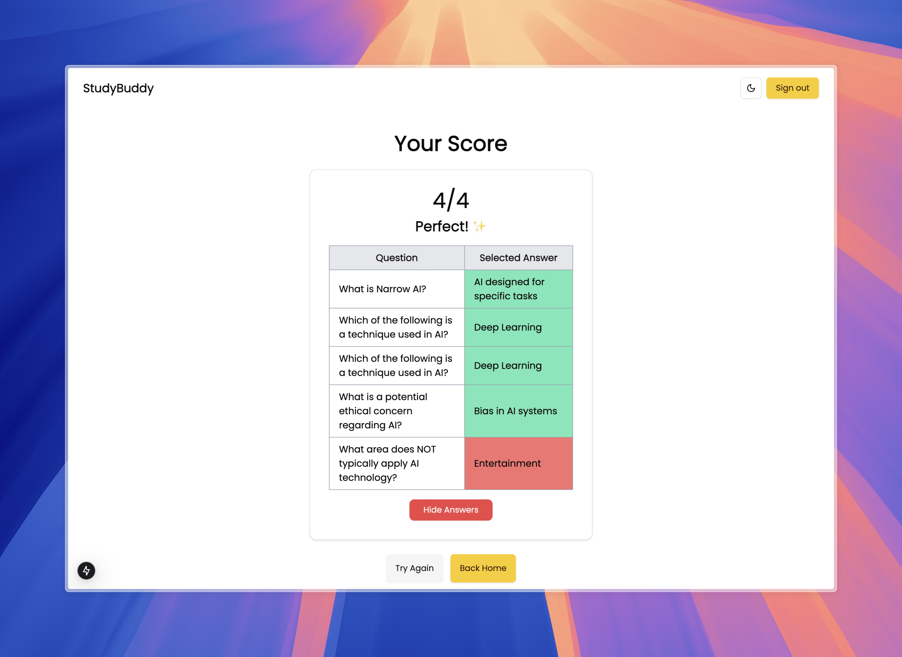

# StudyBuddy 📚✨

## About 🧐

StudyBuddy is an innovative app designed to help students prepare for their lectures by providing them with essential content beforehand. By reviewing lecture summaries and flashcards, students can gain basic knowledge of the topics and enhance their understanding during the lecture. 🚀

## Features 🔥

- Upload lecture documents and get simple summaries.
- Generate interactive flashcards based on lecture content.
- Scoreboard to track your progress and performance. 🏆

## Tech Used 🛠️

- **Frontend**: Next.js
- **Backend**: Supabase
- **Styling**: Tailwind CSS
- **Additional Libraries**: React, Radix UI, and more!

## Images of the Product 🖼️

Here are some snapshots of StudyBuddy:

- **Home Page**  
  

- **Upload Document Page**  
  

- **Lecture Summary View**  
  

- **Flashcards Page**  
  

- **Scoreboard Page**  
  

- **Settings Page**  
  

- **Help Page**  
  
